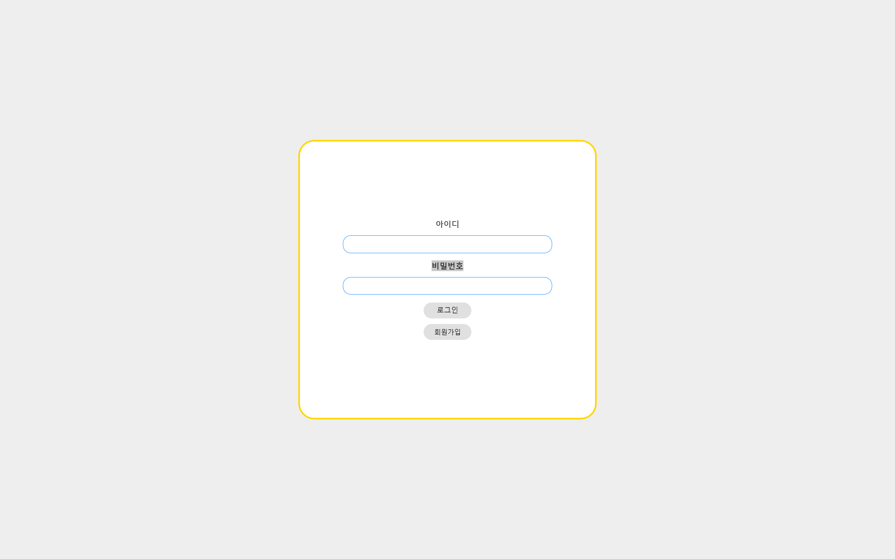
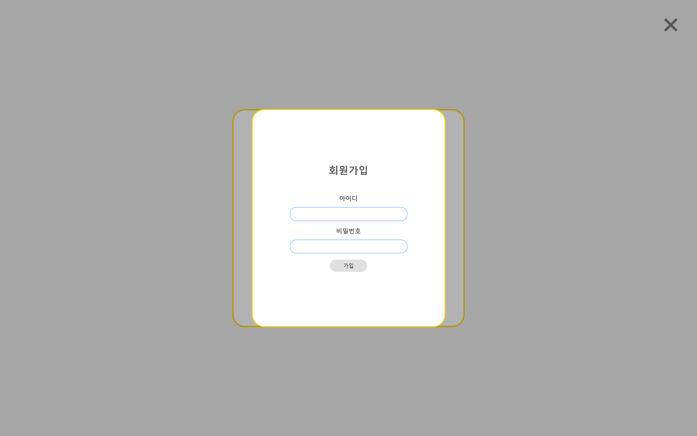
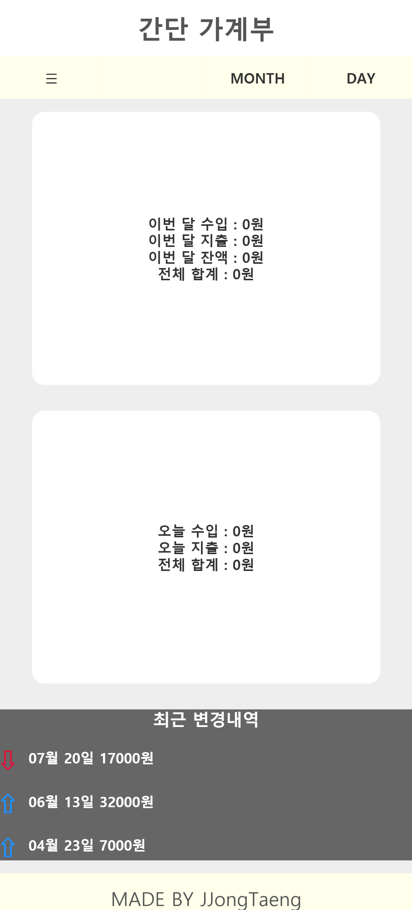
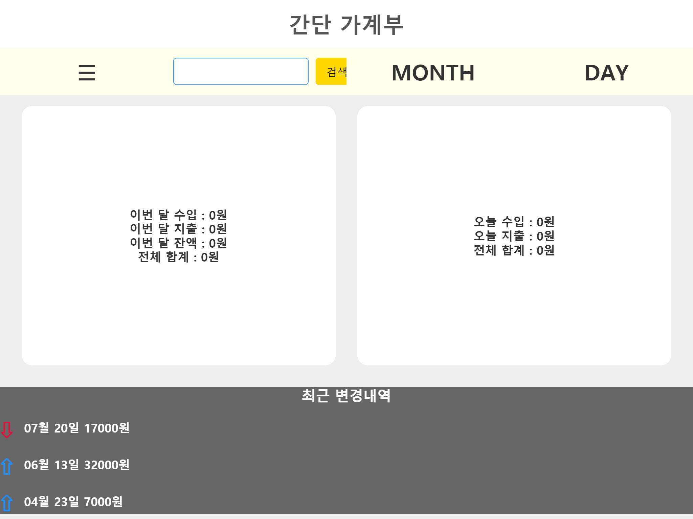
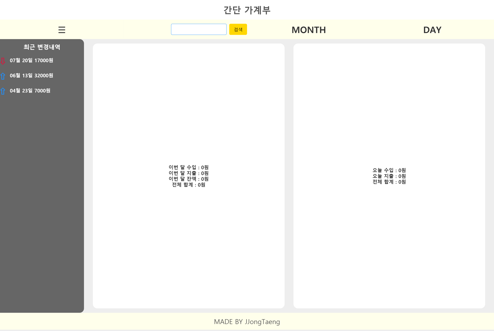
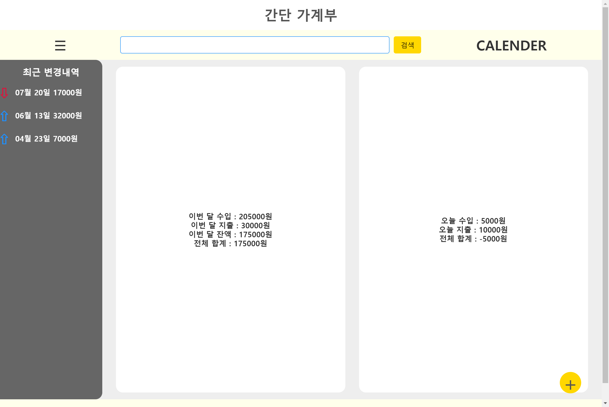
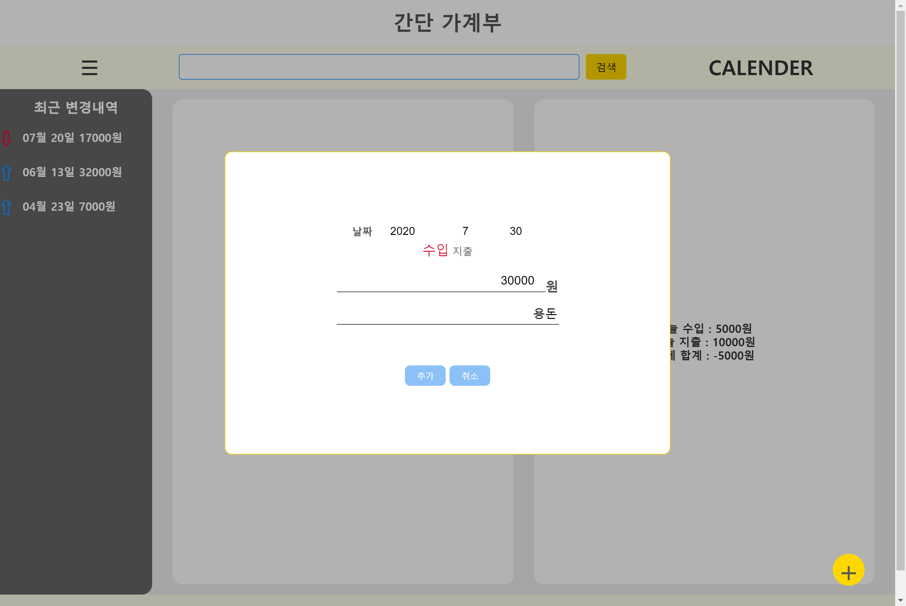

# 간단 가계부

## 로그인 페이지

### 구현내용
  - 로그인 페이지
  - 로그인 클릭 시 메인페이지 이동
  - 회원가입 클릭 시 회원가입 모달창 생성
### 미구현 내용
  - 로그인 시 ID/PW 비교 후 회원만 메인페이지로 이동 (07/30 DB연동 구현 / session X)
  - node.js + mySQL 공부 후 구현 예정 (07/30 가장 기본적인 기능들로 구현 완료)

## 회원가입 페이지

### 구현내용
  - 회원가입 페이지
  - 가입 시 데이터베이스에 계정정보 저장
### 미구현 내용
  - 회원가입 시 데이터베이스에 데이터 저장 (07/30 데이터베이스 구현 / 보안 X)
  - node.js + mySQL 공부 후 구현 예정 (07/30 가장 기본적인 기능들로 구현 완료)

## 메인 페이지

 
 

### 구현 내용
  - 메인 페이지
  - 반응형으로 0-800px / 800-1100px / 1100- 로 나누어 구현
### 미구현 내용
  - 메뉴바 Month, Day 클릭 시 달력으로 날짜 선택
  - 날짜 별 수입 지출 데이터 입력 (07/30 기본적인 형태로 구현완료)
  - 좌측 사이드에서 최근에 저장한 데이터 내역 출력
  - 이것을 node.js + mySQL로 구현

## 2020.07.30 (수정)
  ### 구현내용
  - 로그인 / 회원가입 DB(mysql) 연동 (세선 X)
  - 로그인 정보 일치 시 메인페이지 이동ㅇ
  - 우측 하단에 + 버튼 생성
  - 날짜 / 수입 / 지출 / 금액 입력 후 저장 누르면 메인 페이지 중앙에 변경된 값 출력

  ### 미구현 내용
  - 최대한 프레임워크를 사용하지 않고 구현
  - 프레임워크를 사용하지 않고 세션을 구현하는 내용을 찾기 어려워서 실패
  - 당분간은 node.js + javascript 최신구문 (ES6+)를 공부할 예정입니다.
  - 세션 연동하여 로그인 보안과 유지 기능 추가
  - javascript로 달력 출력하여 편의성 증가
  - 좌측 사이드 바 최신 변경내역

  
  