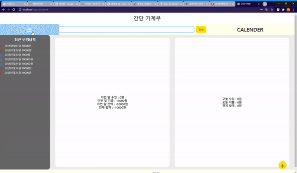

```
                    ____   _                    _
                   / ___| (_) _ __ ___   _ __  | |  ___
                   \___ \ | || '_ ` _ \ | '_ \ | | / _ \
                    ___) || || | | | | || |_) || ||  __/
                   |____/ |_||_| |_| |_|| .__/ |_| \___|
                                        |_|
    _                                      _     ____                 _
   / \     ___   ___   ___   _   _  _ __  | |_  | __ )   ___    ___  | | __
  / _ \   / __| / __| / _ \ | | | || '_ \ | __| |  _ \  / _ \  / _ \ | |/ /
 / ___ \ | (__ | (__ | (_) || |_| || | | || |_  | |_) || (_) || (_) ||   <
/_/   \_\ \___| \___| \___/  \__,_||_| |_| \__| |____/  \___/  \___/ |_|\_\
```

## 로그인 페이지


### ToDo List
  - [x] ~~로그인 클릭 시 메인페이지 이동~~
  - [x] ~~회원가입 클릭 시 회원가입 모달창 생성~~
  - [x] ~~로그인 시 ID/PW 비교 후 회원만 메인페이지로 이동~~ (07/30 DB연동 구현 / session X)

## 회원가입 페이지


### ToDo List
  - [x] ~~가입 시 데이터베이스에 계정정보 저장~~
  - [x] ~~회원가입 시 데이터베이스에 데이터 저장~~ (07/30 데이터베이스 구현 / 보안 X)

## 메인 페이지

<br>
<br>


### ToDo List
  - [x] ~~반응형으로 0-800px / 800-1100px / 1100- 로 나누어 구현~~
  - [x] ~~메뉴바 클릭 시 전체 데이터 출력~~(08/05 구현완료)
  - [ ] Calender 클릭 시 달력으로 날짜 선택
  - [x] ~~날짜 별 수입 지출 데이터 입력~~ (07/30 기본적인 형태로 구현완료)
  - [x] ~~좌측 사이드에서 최근에 저장한 데이터 내역 출력~~ (08/05 구현완료)
  - [x] ~~로그아웃 버튼 클릭 시 로그아웃~~(09/08)


## 2020.07.30 (수정)
  ### ToDo List
  - [x] ~~최대한 프레임워크를 사용하지 않고 구현~~(09/08 구현완료)
  - [x] ~~프레임워크를 사용하지 않고 쿠기 로그인 구현~~ (09/08 구현완료)
  - [x] ~~당분간은 node.js + javascript 최신구문 (ES6+)를 공부할 예정입니다.~~ (09/08 완료)
  - [ ] 세션 연동하여 로그인 보안과 유지 기능 추가 (express를 사용해 구현 예정)
  - [ ] javascript로 달력 출력하여 편의성 증가 (필수적 기능이 아니어서 추후 구현)
  - [x] ~~좌측 사이드 바 최신 변경내역~~(08/05 구현완료)

  
  

## 2020.08.05 (수정)
  
  - 좌측 사이드 바에 최근변경내역 DB연동 후 출력 
  - 좌측 상단 메뉴바 클릭 시 전체 데이터 슬라이더 출력

  

## 2020.09.08 (수정)

  - 로그아웃 버튼과 쿠키를 이용한 로그인 기능 구현
  - Express 프레임워크를 이용하여 리뉴얼 계획
    1. [ ] AJAX 형태로 구현 예정 (axios + 라우터(미들웨어))
    2. [ ] npm 모듈을 이용해 쿠키를 세션 암호화